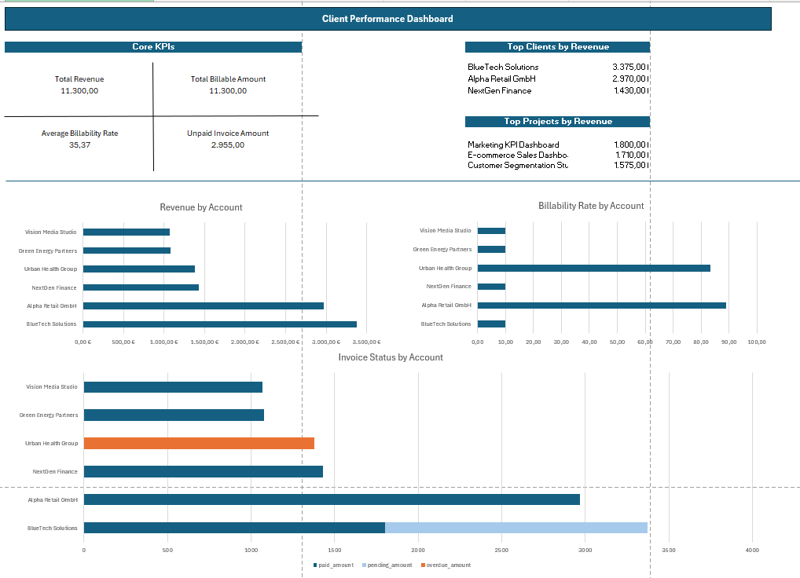

# Client Performance Dashboard

This is a personal portfolio project I built to practice SQL-based business analysis and dashboard reporting.

The project is based on a small simulated service company dataset and focuses on client, project, timesheet, and invoice performance.  
I used SQL to explore and summarize the data, and then created an Excel dashboard to present the main results in a clearer and more business-oriented way.

## Project Goal

The goal of this project was to practice turning raw business data into simple management-style reporting.

More specifically, I wanted to practice:

- exploring structured business data with SQL
- summarizing performance at account level
- comparing revenue, billable work, and invoice status
- presenting the results in a dashboard format

## Project Overview

This project began as a SQL analysis exercise on client and project revenue.  
Later, I expanded it into a dashboard-oriented reporting project with a stronger account performance focus.

The analysis is based on four source tables:

- `clients.csv`
- `projects.csv`
- `timesheets.csv`
- `invoices.csv`

From these source tables, I created summary outputs to support dashboard reporting, such as:

- account performance summary
- account payment summary
- account rate summary

## Dashboard Preview

## Main Questions

This project looks at questions such as:

1. Which clients generate the most revenue?
2. How many projects are linked to each client?
3. How many billable and non-billable hours are recorded by account?
4. Which accounts have pending or overdue invoice amounts?
5. What is the average billable rate by account?
6. Which clients and projects are the strongest contributors to revenue?

## Dataset

The project uses four main tables:

- `clients.csv`  
  Basic client information

- `projects.csv`  
  Project information and client mapping

- `timesheets.csv`  
  Harvest-style timesheet data with billable hours, rates, and billable amount

- `invoices.csv`  
  Invoice data including invoice amount and payment status

## Tools Used

- SQL
- Excel
- GitHub
- CSV files as source data

## SQL Skills Used

In this project, I used:

- `SELECT`
- `WHERE`
- `GROUP BY`
- `ORDER BY`
- `LEFT JOIN`
- aggregate functions such as `SUM()` and `COUNT()`
- `CASE WHEN`
- `CTE`
- window functions such as `RANK()` and cumulative sums

## Dashboard Content

The Excel dashboard includes:

- core KPIs
- top clients by revenue
- top projects by revenue
- revenue by account
- billability rate by account
- invoice status by account

## Key Results

Some of the main results shown in the dashboard are:

- BlueTech Solutions is the top client by revenue
- Alpha Retail GmbH is the second largest client by revenue
- some accounts show strong billability, while others have lower billability
- unpaid invoice exposure can be identified at account level
- revenue and account performance can be compared more clearly in dashboard form than in raw tables

## Files

### Data
- `data/clients.csv`
- `data/projects.csv`
- `data/timesheets.csv`
- `data/invoices.csv`

### SQL
- `sql/01_exploration.sql`  
  Initial exploration of the tables

- `sql/02_client_revenue_analysis.sql`  
  Revenue and hours analysis by client

- `sql/03_project_revenue_analysis.sql`  
  Revenue and hours analysis by project

- `sql/04_revenue_ranking.sql`  
  Ranking and revenue share analysis using CTEs and window functions

- `sql/05_account_performance_summary.sql`  
  Account-level performance summary

- `sql/06_account_payment_summary.sql`  
  Account-level payment summary

- `sql/07_account_rate_summary.sql`  
  Account-level rate summary

### Images
- `images/client_performance_dashboard_excel.png`

## What I Practiced in This Project

This project helped me practice a simple end-to-end workflow:

- preparing a small business dataset
- writing SQL queries for analysis
- creating summary tables for reporting
- building a dashboard in Excel
- presenting results in a portfolio format on GitHub

## Possible Next Steps

Possible next steps for this project are:

- building a Power BI version of the dashboard
- adding monthly trend analysis
- comparing billed work and invoiced revenue in more detail
- improving dashboard design and interactivity

## Author

Ruomeng Xu
