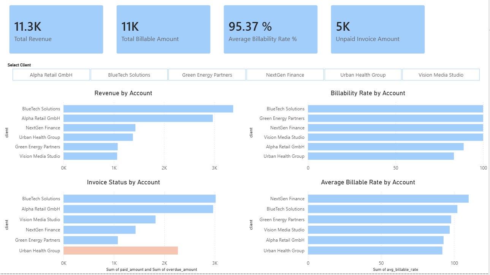

# Client Performance Dashboard

This is a personal portfolio project I built to practice SQL-based business analysis and dashboard reporting.

The project uses a small simulated business dataset with client, project, timesheet, and invoice data.  
I used SQL to explore and summarize the data, and then created an Excel dashboard to present the main results in a clearer and more business-focused way.

## Dashboard Preview

### Excel Version

### Power BI Version

## Project Focus

This project looks at questions such as:

- Which clients generate the most revenue?
- How many projects are linked to each client?
- How many billable and non-billable hours are recorded by account?
- Which accounts have pending or overdue invoice amounts?
- What is the average billable rate by account?

## Dataset

The project uses four source tables:

- `clients.csv`
- `projects.csv`
- `timesheets.csv`
- `invoices.csv`

## Tools Used

- SQL
- Excel
- GitHub

## SQL Skills Used

- `SELECT`
- `WHERE`
- `GROUP BY`
- `ORDER BY`
- `LEFT JOIN`
- `CASE WHEN`
- `CTE`
- window functions such as `RANK()`

## Dashboard Content

The Excel dashboard includes:

- core KPIs
- top clients by revenue
- top projects by revenue
- revenue by account
- billability rate by account
- invoice status by account

## Files

### Data
- `data/clients.csv`
- `data/projects.csv`
- `data/timesheets.csv`
- `data/invoices.csv`

### SQL
- `sql/01_exploration.sql`
- `sql/02_client_revenue_analysis.sql`
- `sql/03_project_revenue_analysis.sql`
- `sql/04_revenue_ranking.sql`
- `sql/05_account_performance_summary.sql`
- `sql/06_account_payment_summary.sql`
- `sql/07_account_rate_summary.sql`

### Images
- `images/client_performance_dashboard_excel_version.png`

## What I Practiced

- exploring business data with SQL
- creating account-level summary tables
- building a simple dashboard in Excel
- presenting the work in a portfolio format on GitHub

## Author

Ruomeng Xu
